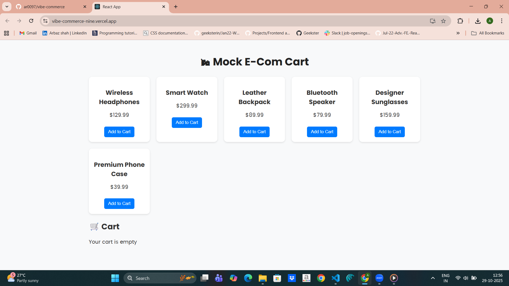
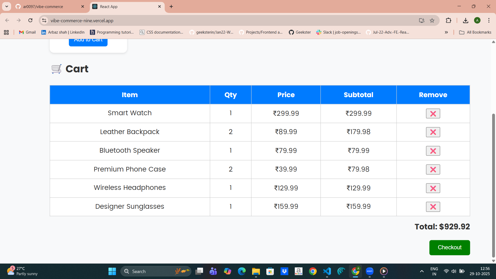
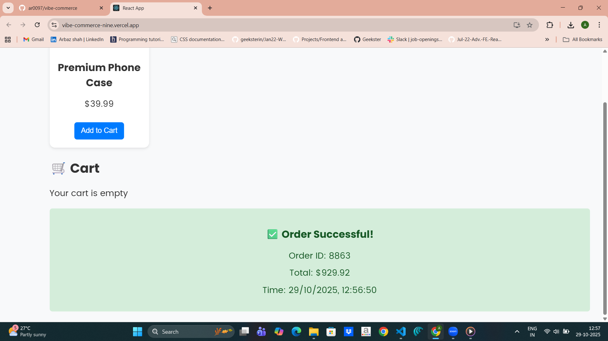

# 🛍 Mock E-Commerce Cart

**Full Stack Internship Assignment – Vibe Commerce**  

A simple **full-stack shopping cart application** built with **React (frontend), Node.js + Express (backend), and in-memory data**.  
Allows adding/removing products, viewing cart totals, and performing a mock checkout.

---

## 📂 Features

### Backend (Node.js + Express)
- **GET /api/products** → Retrieve all products  
- **POST /api/cart** → Add product to cart (`{ productId, qty }`)  
- **DELETE /api/cart/:id** → Remove product from cart  
- **GET /api/cart** → Get cart items with subtotal & total  
- **POST /api/checkout** → Mock checkout, returns receipt (`total`, `timestamp`)  

**Notes:**  
- Uses **in-memory data** (no database required)  
- Can be deployed on **Render / Railway / Vercel serverless**  

### Frontend (React + Pure CSS)
- Products displayed in a responsive grid  
- Add items to cart  
- View cart with item quantity, subtotal, and total  
- Remove items from cart  
- Checkout form showing a receipt modal  

---

## 🚀 Setup Instructions

### 1️⃣ Backend
1. Clone the repo and navigate to backend folder:

```bash
git clone https://github.com/ar0097/vibe-commerce.git
cd backend
npm install
node server.js
```

### API Endpoints (test with Postman or browser):
GET    /api/products
GET    /api/cart
POST   /api/cart      { "productId": 1, "qty": 2 }
DELETE /api/cart/:id
POST   /api/checkout  { "cartItems": [...] }

Local server URL: http://localhost:5000


### 2️⃣ Frontend
1. Clone the repo and navigate to backend folder:

```bash
git clone https://github.com/ar0097/vibe-commerce.git
cd frontend
npm install
npm start
```


## 🖼 Screenshots

**Products Grid**  


**Cart View**  


**Checkout Receipt**  


---


## 🎥 Demo Video

[Watch the Demo Video](https://drive.google.com/file/d/1c9SvyotHLlbpLy2RPpntlNkLVBOns_su/view?usp=drive_link)


